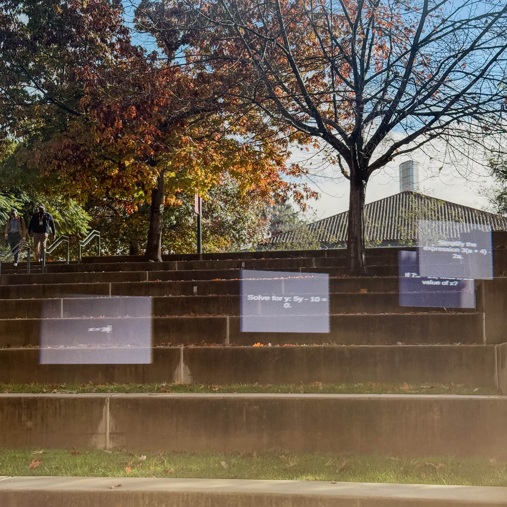

[](https://opensource.org/licenses/MIT)
[](https://devpost.com/software/xquizite)
[](https://docs.xreal.com/)
[](https://unity.com/releases/editor/whats-new/6.0.0)
[](https://www.xreal.com/)
[](https://learn.microsoft.com/en-us/dotnet/csharp/)
[](https://developer.android.com/)

# <p align="center">XQuizIte</p>

<p align="center">
  
</p>

**Flashcard-powered XR learning for XREAL glasses, conceptualized at Immerse The Bay 2025**

## Getting Started  
To start working, first set up the repository locally.
```bash
git clone https://github.com/IceGawd/XQuizIte.git
cd xquizite
```
Check the [Wiki](https://github.com/IceGawd/XQuizIte/wiki) for further information on building in Unity.


## Project Overview  
XQuizIte is an immersive XR study app designed for XREAL glasses. It transforms traditional flashcard learning into a spatial experience, helping users retain information through visual engagement and spatial memory. Whether you're prepping for exams or brushing up on trivia, XQuizIte makes studying feel like play.

## Media  




> ** Disclaimer**  
> XQuizIte is currently in an active hackathon development phase at Immerse the Bay 2025. Some documentation, features, and polish may be incomplete or evolving. We’ll be updating this README and related resources post-hackathon.  
> Check out our DevPost submission here: [XQuizIte on DevPost](https://devpost.com/software/xquizite)
> 

## License

This project is licensed under the [MIT License](./LICENSE).
